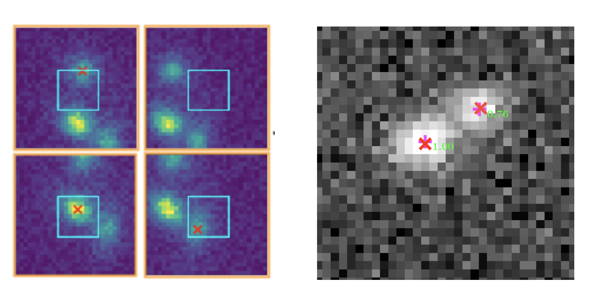

## About me

I'm a fifth-year Physics PhD student at the University of Michigan. My research focuses in developing novel statistical techniques to solve problems in cosmology. I'm also an active member of the LSST-DESC collaboration. 

## Research

* Weak Lensing Systematics and Simulations
* Galaxy-Galaxy Blending
* Machine Learning for Cosmology
* Simulation-Based Inference
* Galaxy-Halo Connection

## News
